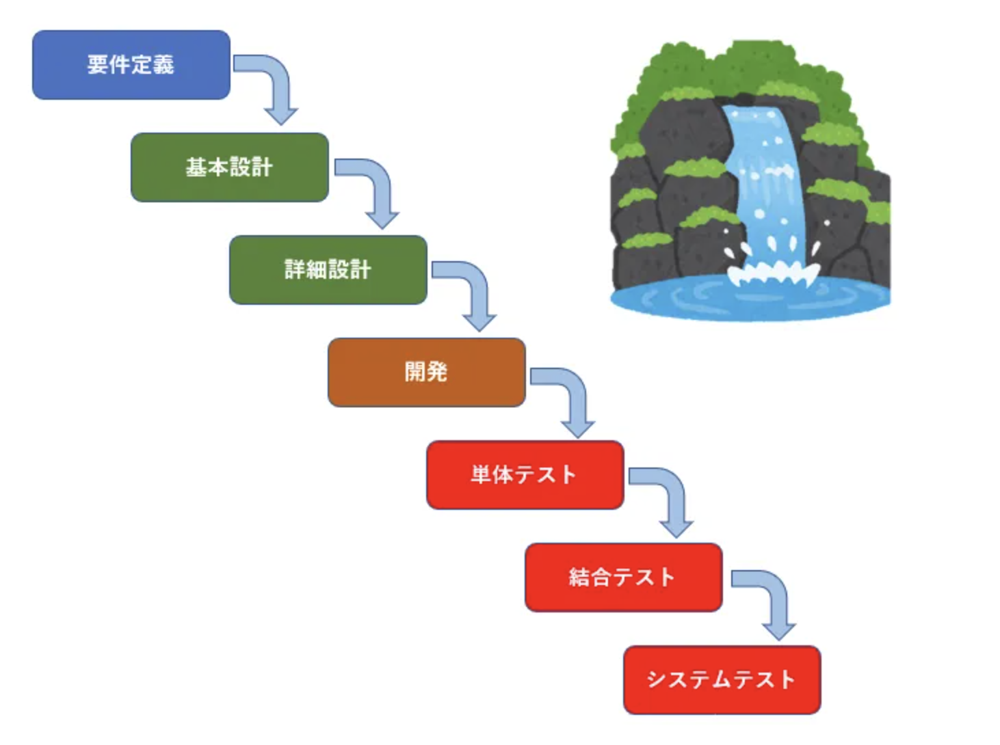
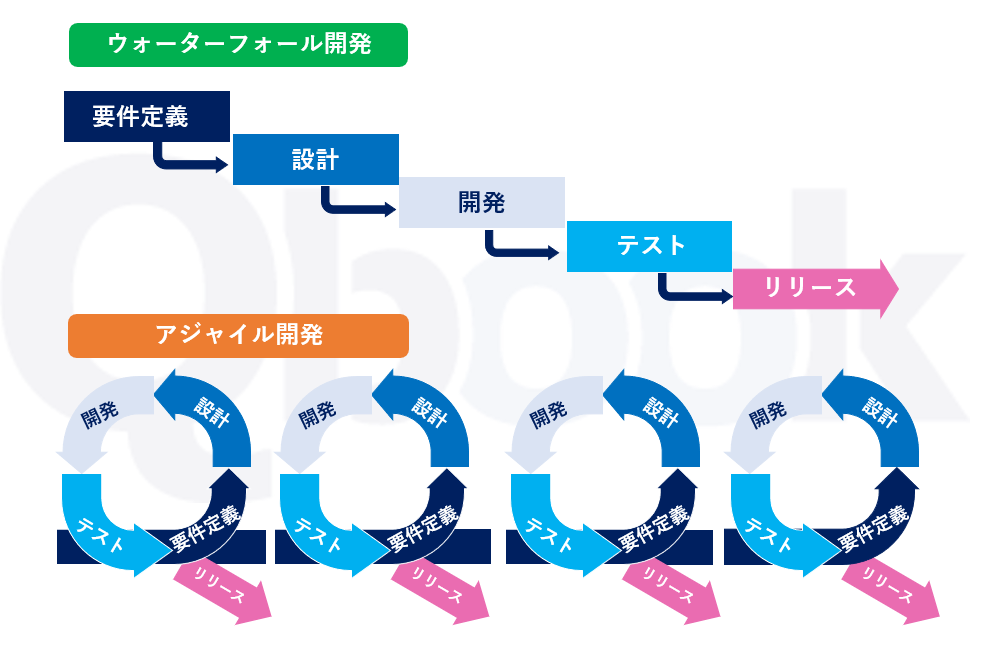

# 《ソフトウェアのプロジェクト設計理論》
### ーー作成者　王正
 

## 設計とは
本当に希望された結果（成果物）を達成されるように、規約をするもの。
## 設計の目的
本当に希望したいものを正しく精確で実現できること。

## 設計の範囲・分類
- 読者の視点からで言うっと、外部と内部分けています、言い換えれば外部設計書と内部設計書分けています。
 　　外部とは、使用者向け表示すること、外見的な感覚できること。外面仕様、機能動作、性能など。
 　　内部とは、エンジニア向け表示すること。目で見えない、感じ出来ないこと。ソースのアーキテクチャ、コード名、呼び出し関係など。

- システム観点で言うっと、論理と物理分けています、言い換えれば論理設計書と物理設計書。
 　　論理設計とは、主に「何を」（What）を明らかにすること。
 　　物理設計とは、主に「どうやって」（How）を明らかにすること。

## 現在主流な設計思想
現在主流な設計思想は二つである：
1. ウォーターフォール式（water fall）
2. アジャイル式（agile）

## ウォーターフロー式の設計思想
ウォーターフォール（瀧）のように、上から下まで順番で進むこと。
 

|工程順番|行程目的|工程例|設計書類例|
|-------|-------|------|---------|
|要求分析|使用者の希望や目的などを洗い出すこと|要望：管理者が各役職の使用者の使用権限を調整出来ますように。| 要求分析書 |
|要件定義|要求についてシステムに実現すべきことを洗いだす。|以下のような要件を決めること： -どんな役職がある？ -各役職応じてどんな権限をつけたい？ -各権限に応じててどんな権力がある（見えることか操作できる権限など）？|-ER(Entity Relationship)図 -業務フロー図 -機能要件書（実装する機能） -非機能要件書（求める性能やセキュリティ）
| 基本設計    | 使用者レベルに、理解できることを決める。システムによって画面仕様、機能仕様、遷移関係、入出力仕様など。| - 画面はどん様子で良い - システムの物理的にどんな機能が必要 - 入力パラメーターと出力パラメーターは 等　　　　　　 |- 画面仕様図 - 画面遷移図 - 機能仕様書 - データベース設計図 - バッチ設計図 - 等 |
| 詳細設計    |エンジニア向けの設計、ソースコードレベルの設計。（このレベルは使用者にとって関心か理解必要はない） |- コード名はどうやって命名 - クラス、メソッドなどがどうやって命名 - ソースの機能ロジック設計、呼び出す方法など|- （詳細）画面仕様図 - （詳細）画面遷移図 - （詳細）機能仕様書 - （詳細）データベース設計図 - （詳細）バッチ設計図 - 等 |
| 単体テスト   |システムの個々のコンポーネント（クラス、メソッド、関数など）が正しく機能することを確認する|  |単体テスト仕様書|
| 結合テスト   |単体テスト検証したコンポーネント（複数）の組合（結合と言う）が正確的動作されることを確認。|  |結合テスト仕様書|
| システムテスト（総合テスト）|使用者視点から各業務パターン、仕様要求、性能などが要求通りに動作されること。|  |システムテスト仕様書（業務パターンなど）|
 

## アジャイル式の設計思想
アジャイル（Agile）とは、直訳すると「素早い」「機敏な」「頭の回転が速い」という意味を表します。アジャイル開発とは、システムやソフトウェア開発におけるプロジェクト開発手法の1つで、大きな単位でシステムを区切ることなく、小単位で実装とテストを繰り返して開発を進めていく手法を指します。従来の開発手法に比べて開発期間が短縮されるため、アジャイル（素早い）と呼ばれています。
 

### アジャイル式とウォーターフロー式の差別
- ウォーターフロー式は主に一回的で完全的の完成（設計からリリースまで完成）、なので、設計から全ての仕様を明確して定版しなければなりません。作業量はシステム全体ついての体量です。
- アジャイル式は、システムを早めに能動的を目指す（完璧ではない）、なので、仕様が明確していない場合があっても、仕様の目的について自己決めても大丈夫です。一旦今後が間違いとか、不足とかありましたら、再度設計からやり直して「設計→開発→テスト→リリース」で最リリースします。作業量はシステムの一部小単位の体量です、体量が大きいではないため、素早い調整できます。

## プロジェクト設計と管理原則
プロジェクトを設計する時に、原則として、粒度の粗から細まで彫りことになります。
### 順番的には
1. システム企画
　 システムの目的と必要な機能、表現仕様を洗い出す。
2. 要求整理と定義
3. 要件定義で必要な書類（以下だけ限りません）
 ER図
 業務フロー図
 機能定義書
 など
4. 基本設計書（以下だけ限りません）
 システムアーキテクチャ設計書
 (基本)機能仕様書
 (基本)画面仕様図
 データモーデル(data model)
 画面遷移図
 など
5. 詳細設計書（以下だけ限りません）
 (詳細)機能仕様書
 (詳細)画面仕様図
6. 単体テスト
 コンポーネントの単位で正確性を確認します。
7. 結合テスト
 複数のコンポーネントかモジュールなの組合単位で正確性を確認します。
8. システムテスト（総合テスト）
 業務仕様、業務フロー、業務パータンを基づいて、システムの使用目的に向けて、正しいことを確認する。

9. リリース
  システムアーキテクチャ設計に基づいて、リリースをします。

## プロジェクト管理について
1. WBS（work Breakdown schedule）を策定。
 　　実際作業内容を基づいて、生産量とスケジュールを決めます。
2. 現実と想定スケジュールズレる発生（遅延）場合は
 　　遅延が発生した場合は、詰まった問題点をすぐ見つけ出すべきです、確認内容は「どこ、なに、なんで、だれ」。
 　　どこか問題発生した　ーー問題場所を明確。
 　　どんな問題でしょうか ーー問題内容を明確。
 　　なんで発生した（可避・不可避）　ーー問題原因、性質を明確。
 　　誰かやっている　ーー人の能力の問題でしたら人を調整、人の問題ではないと、スケジュール調整か、作業方針を調整します。